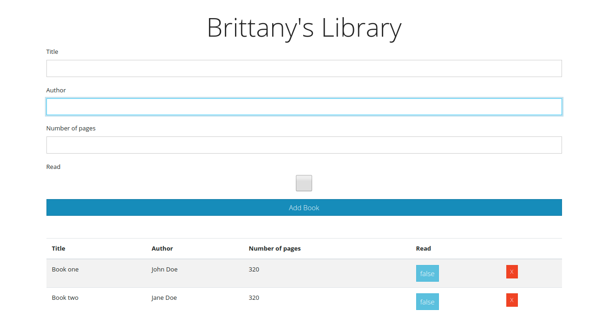

<!--
*** Thanks for checking out this README Template. If you have a suggestion that would
*** make this better, please fork the repo and create a pull request or simply open
*** an issue with the tag "enhancement".
*** Thanks again! Now go create something AMAZING! :D
-->

<!-- PROJECT SHIELDS -->
<!--
*** I'm using markdown "reference style" links for readability.
*** Reference links are enclosed in brackets [ ] instead of parentheses ( ).
*** See the bottom of this document for the declaration of the reference variables
*** for contributors-url, forks-url, etc. This is an optional, concise syntax you may use.
*** https://www.markdownguide.org/basic-syntax/#reference-style-links
-->
Library -- [Librarian]
This project is part of the Microverse curriculum in Ruby on Rails module!

<!-- TABLE OF CONTENTS -->
## Table of Contents

* [About the Project](#about-the-project)
  * [Built With](#built-with)
* [Contact](#contact)
* [Acknowledgements](#acknowledgements)
* [License](#license)

<!-- ABOUT THE PROJECT -->
## About The Project

This is library app to and remove books
<!-- INSTALLATION -->
## Installation

To have this app on your pc, you need to:
* have to enable javascript on your browser and a code editor
* [download](git@github.com:evabanegacom/Library.git) or clone this repo:
  - Clone with SSH:
  ```
    git@github.com:evabanegacom/Library.git
  ```
  - Clone with HTTPS
  ```
    https://github.com/evabanegacom/Library.git
  ```
* Open the terminal inside the cloned directory:-

# Live Demo
- (https://raw.githack.com/evabanegacom/Library/feature/index.html)



### Built With
This project was built using these technologies.
* Html & css
* Javascript
* Bootstrap framework
* eslint
* VsCode
<!-- CONTACT -->
## Contributors

👤 **Brittany** 

- Github: [@BrittanyBlake](https://github.com/BrittanyBlake)
- Linkedin: [Brittany Blake](https://www.linkedin.com/in/brittany-a-blake) 


👤 **Precious**

- GitHub: [@Precious](https://github.com/evabanegacom)

<!-- ACKNOWLEDGEMENTS -->
## Acknowledgements
* [Microverse](https://www.microverse.org/)
* [The Odin Project](https://www.theodinproject.com/)
